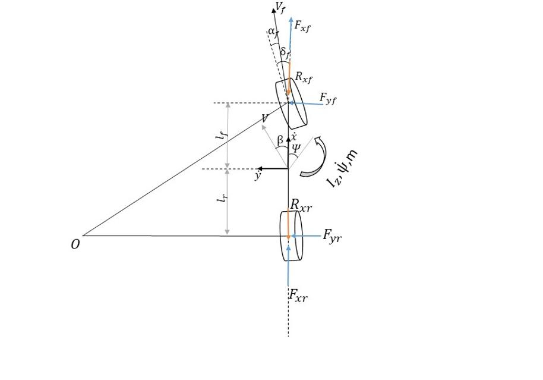
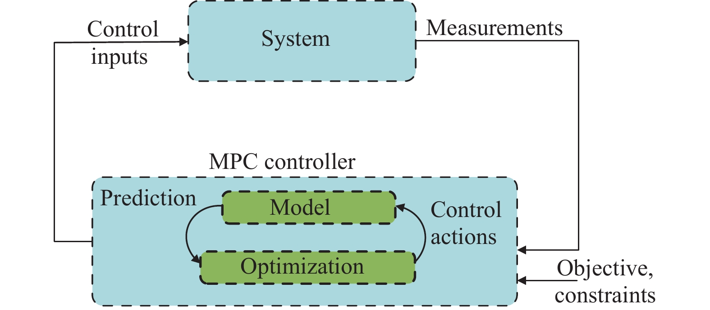

# OPtimization-Based Trajectory Planning and MPC-Tracker working along with a Reinforcement Learning planner
### Trajectory Planning 
Trajectory planning is an essential task of autonomous vehicles. It serves as a path that the vehicle will follow using a controller to reach a destination.
### Optimization
Optimization is the methodological enhancement of a state or a system. It is a measure or the objective expressed in quantity to minimize.
## Optimal Control Problem (solver: OSQP)
The optimization-based trajectory is expressed by the trajectory planning task as an optimal control problem (OCP).
The OCP can be solved using SQP or OSQP. In this project, OSQP is used to find the optimal control points for the vehicle.

OSQP solves the convex quadratic optimization problem: [OSQP-CPP] (https://github.com/google/osqp-cpp)
## Dynamic Vehicle model
The vehicle mode used for the trajectory planner is a Dynamic model of a vehicle. A Dynamic model is obtained by considering the slip angle on the vehicle at higher velocities and forces on the bicycle model. 
#### Assumptions:
* Only front wheel steering angle.
* Longitudinal slip on the vehicle tire is zero.

# Model Predictive controller (MPC-Tracker)
Model predictive control (MPC) works on the principle of predicting the future behavior of a controlled system over a finite time horizon and computing an optimal control input. The calculated control input satisfies the constraints of the control system while minimizing the cost function. 
The first input of the trajectory is applied to the system. The whole process is repeated again until the next control point.

## Kinematic Vehicle Model
A kinematic model is a purely mathematical model without considering the forces acting on the vehicle. 
* The kinematic model is more accurate with lower distances and for larger discretized time.
* Computational time and complexity are lower.

           $\frac{\partial x}{\partial t}$ = V x $\sin( \theta )$

           $\frac{\partial y}{\partial t}$ = V x $\cos(\theta)$

           $\frac{\partial \theta}{\partial t}$ =V x $\tan(\delta)$/L

           $\frac{\partial v}{\partial t}$ = a

